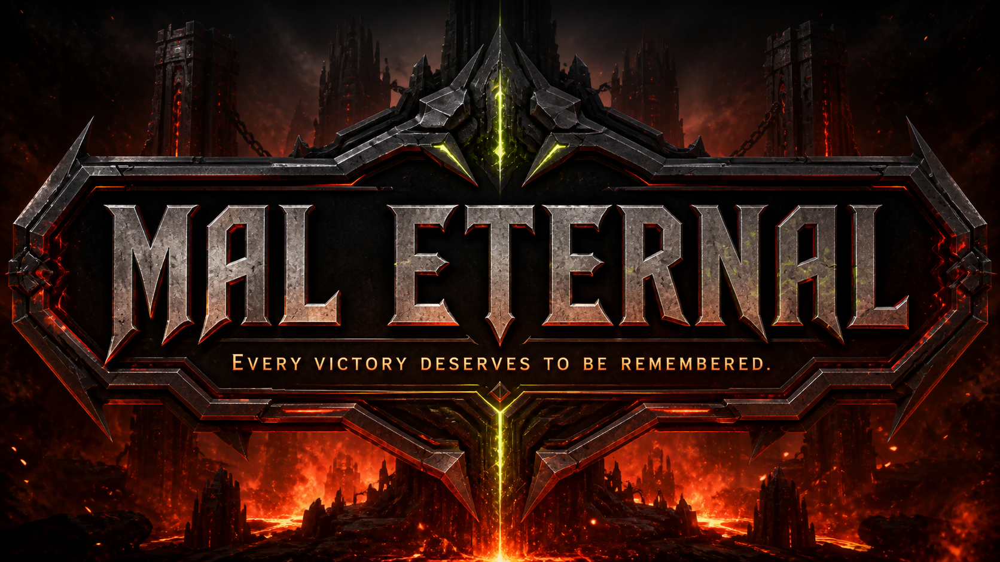

# MAL Eternal

> **Shotgun shells blaze red, demons awaken at night. Halo may stretch to infinity—but your victories are Eternal.**

MAL Eternal is a private, Doom-inspired achievement command center for recording victories, exploring Gregorian and Solar Hijri timelines, searching archives, and viewing analytics—with cinematic audio, bilingual English/Persian UI, and RTL support.



## Highlights

- Cinematic introduction with timed monologue subtitles, continuous music, and a laser-gate transition.
- Doom-oriented command center with dedicated achievement and analytics rails.
- Complete achievement creation, editing, deletion, validation, tags, categories, importance levels, and milestone support.
- Seasonal Chronicle views for both Gregorian and Solar Hijri calendars, including calendar equivalents and native month names.
- Expandable season → month → achievement trees with keyboard, focus, hover, and touch interactions.
- Searchable and filterable archive covering titles, descriptions, tags, categories, notes, cycles, seasons, and importance.
- Lifetime, cycle, monthly, streak, category, and comparative analytics.
- Full English/Persian localization, RTL layouts, Persian numerals, and bundled Sahel typography.
- Responsive desktop rails, tablet drawers, and mobile navigation, with reduced-motion support.
- Server-enforced record ownership backed by Cloudflare D1.

## Technology

- React 19 and TypeScript
- Vinext and Vite
- Cloudflare Workers and D1
- Drizzle ORM
- Node's built-in test runner and ESLint
- Custom CSS animation and responsive layout system

## Privacy model

This repository contains application code, database schema, migrations, and public UI assets only. It does **not** include:

- Personal achievement records or hosted D1 contents
- User emails, authenticated user identifiers, or account data
- API keys, tokens, cookies, passwords, or `.env` files
- Private deployment project identifiers

Achievement data remains in the configured D1 database. Every achievement and analytics request is scoped to the authenticated user on the server.

## Local development

### Requirements

- Node.js 22.13 or newer
- npm
- A Cloudflare-compatible D1 binding named `DB`

### Setup

1. Install dependencies:

   ```bash
   npm install
   ```

2. Copy `.openai/hosting.example.json` to `.openai/hosting.json`, then replace the placeholder project ID with your own Sites project ID. The local D1 binding name should remain `DB`.

3. Start the development server:

   ```bash
   npm run dev
   ```

4. Open the URL printed by Vite.

The private `.openai/hosting.json` file is intentionally excluded from the public repository.

## Database

The initial D1 migration is stored in [`drizzle/0000_even_mac_gargan.sql`](drizzle/0000_even_mac_gargan.sql). It creates the achievement table and ownership-aware indexes without inserting user records.

Generate a new migration after changing the Drizzle schema:

```bash
npm run db:generate
```

## Quality checks

```bash
npm run lint
npm test
```

`npm test` performs a production build before running the Chronicle and rendered-interface regression tests.

## Project structure

```text
app/          Application shell and authenticated API routes
components/   Intro, command center, dialogs, timeline, and controls
db/           D1 connection and Drizzle schema
drizzle/      Database migrations
lib/          Validation, calendar, localization, and data access
public/       UI artwork, audio, fonts, favicon, and social preview
tests/        Calendar and rendered-interface regression tests
types/        Shared achievement models
worker/       Cloudflare Worker entry point
```

## Deployment

The app is designed for a Cloudflare Worker/Sites environment with a D1 database bound as `DB`. Configure authentication at the hosting layer and keep all environment-specific identifiers and secrets outside version control.

### Render free preview

The included [`render.yaml`](render.yaml) runs a disposable Render preview with Node.js and an ephemeral SQLite database. Each browser receives an anonymous cookie-scoped archive, but records can disappear whenever the free service restarts, spins down, or redeploys. This mode is for evaluation only and must not be used as the durable home of personal achievement data.

For a production Render deployment, replace the preview adapter with managed persistent storage and an explicit owner authentication layer.

## License and attribution

The application code is available under the MIT License. Sahel font attribution is included in [`public/fonts/Sahel-LICENSE.txt`](public/fonts/Sahel-LICENSE.txt).

MAL Eternal is an independent fan project and is not affiliated with or endorsed by id Software, Bethesda Softworks, ZeniMax Media, or Microsoft. DOOM-related names and media belong to their respective owners; review asset rights before redistributing or publicly deploying the bundled media.
